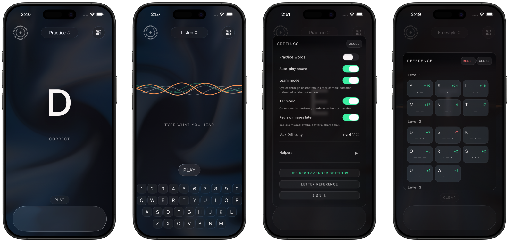

# Dit

**Learn Morse code by ear.**



Dit is a Morse trainer for iOS and web. Instead of teaching you to count dots and dashes, it teaches your ear to recognize each letter as a shape of sound which is the way skilled operators actually copy Morse and has been proven to be more effective for long-term retention.

[](https://apps.apple.com/us/app/dit-practice-morse-code/id6758277876)

Web: [practicedit.com](https://practicedit.com)

## Why this repo is public

I build Dit solo, in the open, and I'd rather show how it works than keep the source hidden. If you're curious how the modes are structured, how Firebase sync stays out of the way when signed out, how we bridge Swift and React Native for audio and haptics, or how a small app handles onboarding so please do look around.

The code is licensed under [AGPL-3.0](LICENSE). You can read it, clone it, run it yourself, and learn from it. You cannot repackage it as a closed commercial product. See [License](#license) below for specifics.

## Status

Dit ships on the App Store and runs on [practicedit.com](https://practicedit.com). It's a solo project, worked on in bursts, and the codebase moves when it needs to rather than on a schedule. Expect the `main` branch to reflect what's currently live, give or take a day.

## How Dit teaches Morse

- **Auditory reflex over decoding.** You learn the _sound_ of each letter, not a mental lookup of dits and dahs.
- **Koch method.** Start at realistic character speed with wide spacing (Farnsworth), introduce high-frequency letters first, and bring the gaps in as you get faster.
- **Variable effective speed.** Character WPM stays fixed; inter-character gaps tighten with proficiency. This trains the ear at real speeds without overwhelming it.
- **Meaningful words early.** The first letters introduced form real words (TEN, RAT, NET), so practice doesn't feel abstract.
- **Self-paced.** Beginners get a guided course that advances in small packs. Everyone else free-roams across modes without a fixed sequence.

Full pedagogical writeup: [docs/PEDAGOGICAL_PHILOSOPHY.md](docs/PEDAGOGICAL_PHILOSOPHY.md).

## The three modes

- **Practice**: match the prompted letter. Get it right and it moves on; get it wrong and (depending on settings) the app either holds you on the same target or drops it and advances (IFR mode). Word mode strings letters into a full word and reports your WPM at the end.
- **Freestyle**: tap whatever you want, pause, and Dit tells you what letter you sent. Word mode collects decoded letters into a running sentence.
- **Listen**: Dit plays a letter at the speed you pick, you type the answer.

Intended behavior across platforms lives in [docs/APP_BEHAVIOR.md](docs/APP_BEHAVIOR.md).

## Contributing

This is a personal project, so I'm not set up to review outside pull requests. Issues and bug reports are welcome — if you find something broken or confusing, please open one. If you want to build on Dit's ideas, please fork under AGPL-3.0 and make it your own.

---

## For developers

Everything below is here for people who want to run the code locally or understand how it's put together.

### Stack

- Monorepo: Turborepo + pnpm workspaces.
- `packages/core`: shared Morse logic, types, constants, Firebase helpers, React hooks. Both apps depend on it.
- `apps/web`: Vite + React 19.
- `apps/ios`: Expo SDK 55 + React Native 0.81.
- `modules/dit-native`: Swift/UIKit Expo native module for audio playback, haptics, and glass effects.
- iOS also ships `DitProgress`, a home-screen widget that reads the same progress snapshot the in-app Reference view uses.
- Firebase Auth + Realtime Database for optional cross-device sync. Firebase Analytics for basic usage events.
- UI intent: custom React components on web; Expo UI and UIKit on iOS so the system renders Liquid Glass where applicable.

### Repo layout

- `apps/web`: web client (`tests/unit` for Vitest, `tests/e2e` for Playwright).
- `apps/ios`: iOS app (`src/` app code, `ios/` Xcode project and Pods, `plugins/` Expo config plugins, `assets/`, `tests/`).
- `packages/core`: shared logic and types.
- `modules/dit-native`: native module.
- `scripts`: small repo helpers.

### Running locally

```bash
pnpm install                          # workspace deps
pnpm --filter @dit/web dev            # web dev server
pnpm --filter @dit/ios ios            # iOS simulator
pnpm --filter @dit/ios ios --device   # iOS on a connected device
pnpm run dev                          # everything, in parallel, via Turbo
```

### Checks

```bash
pnpm run lint
pnpm run test:unit
pnpm run test:e2e
pnpm run test:types
```

### Environment

Dit reads config from:

- `.env` at the repo root for shared config.
- `apps/ios/.env` for Expo-specific config.
- `apps/ios/GoogleService-Info.plist` for Firebase iOS (local only; copy from `apps/ios/GoogleService-Info.example.plist`).

You'll need your own Firebase project if you want sign-in or sync to work end-to-end. The app runs fine without Firebase — it just keeps all progress local.

## Docs

- [docs/APP_BEHAVIOR.md](docs/APP_BEHAVIOR.md): intended behavior across platforms.
- [docs/PEDAGOGICAL_PHILOSOPHY.md](docs/PEDAGOGICAL_PHILOSOPHY.md): the learning methodology behind the modes and progression.
- [docs/STYLE_GUIDE.md](docs/STYLE_GUIDE.md): code style, naming, and UI design principles.
- [docs/NATIVE_IOS.md](docs/NATIVE_IOS.md): iOS native module architecture.
- [DESIGN.md](DESIGN.md): visual, motion, and interaction direction; also what we've tried and removed.
- [AGENTS.md](AGENTS.md): rules for AI coding agents working in this repo.

## License

Dit is licensed under the [GNU Affero General Public License v3.0](LICENSE).

The short version: you can read the code, run it yourself, and learn from it. If you fork it or deploy a modified copy (including as a network service), your fork must also be released under AGPL-3.0 with full source available to its users.

Copyright © 2026 TYLR (Tyler Robinson). For commercial licensing inquiries, contact tyler@tylerobinson.com.
